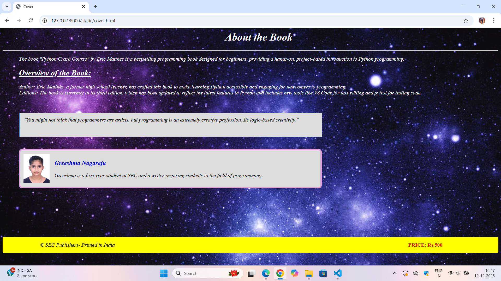

# Ex.05 Book Cover Page Design
## Date:12-12-2025

## AIM:
To design a book back cover page using HTML and CSS.

## DESIGN STEPS:

### Step 1:
Create a Django Admin project.

### Step 2:
Create an app in the Django interface.

### Step 3:
Create a folder named 'static' in the app folder.

### Step 4:
Create a new HTML file in the static folder.

### Step 5:
Write the HTML code with relevant CSS properties.

### Step 6:
Choose the appropriate style and color scheme.

### Step 7:
Insert the images in their appropriate places.

### Step 8:
Publish the website in the LocalHost.

## PROGRAM:

```
cover.html

<html>
    <head>
        <title>Cover</title>
        <link href="style.css" rel="stylesheet">
    </head>
    <body>
        <i>
            <h1>About the Book</h1>
        <hr>
        <p>
            The book "Python Crash Course" by Eric Matthes is a bestselling programming book designed for beginners, providing a hands-on, project-based introduction to Python programming.
        </p>
        <h2><u>Overview of the Book:</u></h2>
        <p>
            Author: Eric Matthes, a former high school teacher, has crafted this book to make learning Python accessible and engaging for newcomers to programming.
            <br>
            Editions: The book is currently in its third edition, which has been updated to reflect the latest features in Python and includes new tools like VS Code for text editing and pytest for testing code
        </p>
        <br>
        <br>
        <div class="box">
            "You might not think that programmers are artists, but programming is an extremely creative profession. Its logic-based creativity."
        </div>
        <br>
        <br>
    
        <div class="container">
            
             <div class="item">  
                <h3>Greeshma Nagaraju</h3>
                <p>Greeshma is a first year student at SEC and a writer inspiring students in the field of programming.</p>
            </div>
        </div>
         <div class="footer">
            <span>&copy SEC Publishers- Printed in India</span>
            </i>
            <b>
             <div class="price">  
             <span class="price">PRICE: Rs.500</span>
            </div>
            </b>
        </div>
    
       
    </body>
</html>

style.css

body
{
    background-image: url('bg.jpg');
    background-size: cover;
}

h1
{
    color: whitesmoke;
    text-align: center;
    margin-left: 50px;
}

h2
{
    color: white;
    margin-left: 50px;
}

p
{
    color: white;
    margin-left: 50px;
}

.box
{
    width: 900;
    height:50;
    background-color: gainsboro;
    border-left: 4px solid steelblue;
    padding: 12px;
    margin-left: 50px;
}
.container
{
    
    width: 900;
    margin-left: 50px;
    background:gainsboro;   
    border:4px solid plum;         
    padding: 10px;
    border-radius: 10px;          
    display: flex; 
    flex-direction: row;               
    align-items: center;          
    gap: 15px;                   
     
}

.footer
{
    
    background-color: yellow;
    margin-top: 150px;
    display: flex;
    padding: 15px;
    border-radius: 4px;
    flex-direction: row;
    gap: 800px;
}

.price
{
    color: red;
}

h3
{
    color:blue;
}

div p
{
    color:black;
    margin-left: 0;
}
span
{
    margin-left: 100;
}
```


## OUTPUT:


## RESULT:
The program for designing book back cover page using HTML and CSS is completed successfully.
